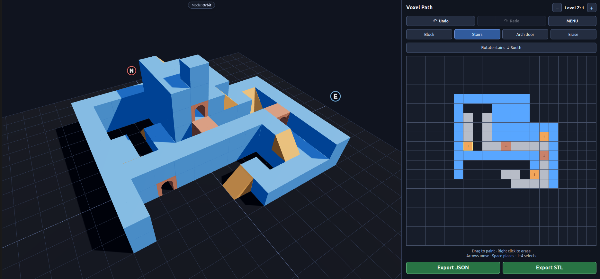
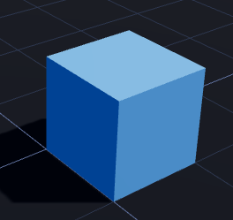
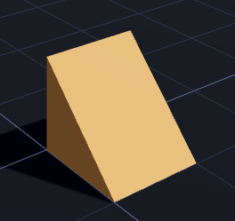
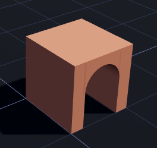

# VoxelPath

A minimalist web-based editor for creating 3D structures and paths. Edit on a grid, layer by layer. Save your design as a JSON file or export it as STL.

### Try it

https://voxel-path.web.app/

Have fun creating your own 3D structures and paths.

- Build layer by layer on a 2D grid.
- Save your creations in an open JSON format to share them or use them in other projects.
- Load existing designs from JSON files.
- Export your creations as STL files for 3D printing.

### Basic elements

Build using a small set of simple elements:

| Block | Stair | Arch |
| :---: | :---: | :---: |
|  |  |  |
